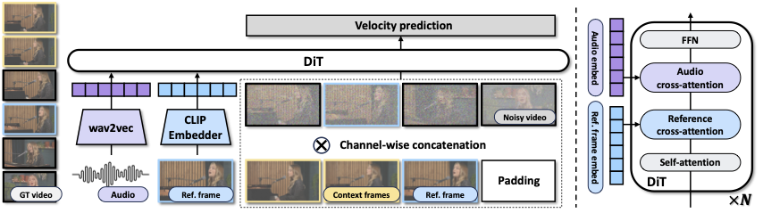

<div align="center">


<h1>InfiniteTalk: Audio-driven Video Generation for Sparse-Frame Video Dubbing</h1>


<a href=''></a>
<a href=''></a>
<a href=''></a>
</div>

> **TL; DR:**  InfiniteTalk is an unlimited-length talking video generation​​ model that supports both audio-driven video-to-video and image-to-video generation

<p align="center">
  
</p>


## 🔥 Latest News

* August 18, 2025: We release the [Technique-Report]() of **InfiniteTalk** 
* August 18, 2025: We release the [project page]() of **InfiniteTalk** 


## ✨ Key Features
We propose **InfiniteTalk**​​, a novel sparse-frame video dubbing framework. Given an input video and audio track, InfiniteTalk synthesizes a new video with ​​accurate lip synchronization​​ while ​​simultaneously aligning head movements, body posture, and facial expressions​​ with the audio. Unlike traditional dubbing methods that focus solely on lips, InfiniteTalk enables ​​infinite-length video generation​​ with accurate lip synchronization and consistent identity preservation. Beside, InfiniteTalk can also be used as an image-audio-to-video model with an image and an audio as input. 
- 💬 ​​Sparse-frame Video Dubbing​​ – Synchronizes not only lips, but aslo head, body, and expressions
- ⏱️ ​​Infinite-Length Generation​​ – Supports unlimited video duration
- ✨ ​​Stability​​ – Reduces hand/body distortions compared to MultiTalk
- 🚀 ​​Lip Accuracy​​ – Achieves superior lip synchronization to MultiTalk


## 🌐 Community  Works
- [ComfyUI]()


## 📑 Todo List

- [x] Release the technical report
- [x] Inference
- [x] Checkpoints
- [x] Multi-GPU Inference
- [ ] Inference acceleration
  - [x] TeaCache
  - [x] int8 quantization
  - [ ] LCM distillation
  - [ ] Sparse Attention
- [x] Run with very low VRAM
- [x] Gradio demo
- [x] ComfyUI


## Quick Start

### 🛠️Installation

#### 1. Create a conda environment and install pytorch, xformers
```
conda create -n multitalk python=3.10
conda activate multitalk
pip install torch==2.4.1 torchvision==0.19.1 torchaudio==2.4.1 --index-url https://download.pytorch.org/whl/cu121
pip install -U xformers==0.0.28 --index-url https://download.pytorch.org/whl/cu121
```
#### 2. Flash-attn installation:
```
pip install misaki[en]
pip install ninja 
pip install psutil 
pip install packaging 
pip install flash_attn==2.7.4.post1
```

#### 3. Other dependencies
```
pip install -r requirements.txt
conda install -c conda-forge librosa
```

#### 4. FFmeg installation
```
conda install -c conda-forge ffmpeg
```
or
```
sudo yum install ffmpeg ffmpeg-devel
```

### 🧱Model Preparation

#### 1. Model Download

| Models        |                       Download Link                                           |    Notes                      |
| --------------|-------------------------------------------------------------------------------|-------------------------------|
| Wan2.1-I2V-14B-480P  |      🤗 [Huggingface](https://huggingface.co/Wan-AI/Wan2.1-I2V-14B-480P)       | Base model
| chinese-wav2vec2-base |      🤗 [Huggingface](https://huggingface.co/TencentGameMate/chinese-wav2vec2-base)          | Audio encoder
| MeiGen-InfiniteTalk      |      🤗 [Huggingface]()              | Our audio condition weights

Download models using huggingface-cli:
``` sh
huggingface-cli download Wan-AI/Wan2.1-I2V-14B-480P --local-dir ./weights/Wan2.1-I2V-14B-480P
huggingface-cli download TencentGameMate/chinese-wav2vec2-base --local-dir ./weights/chinese-wav2vec2-base
huggingface-cli download TencentGameMate/chinese-wav2vec2-base model.safetensors --revision refs/pr/1 --local-dir ./weights/chinese-wav2vec2-base
```

#### 2. Link or Copy MultiTalk Model to Wan2.1-I2V-14B-480P Directory

Link through:
```

```
### 🔑 Quick Inference

Our model is compatible with both 480P and 720P resolutions. 
> Some tips
> - Lip synchronization accuracy:​​ Audio CFG works optimally between 3–5. Increase the audio CFG value for better synchronization.
> - FusionX： While it enables faster inference and higher quality, FusionX LoRA exacerbates color shift over 1 minute and reduces ID preservation in videos.
> - V2V generation: Enables unlimited length generation. The model mimics the original video's camera movement, though not identically. Using SDEdit improves camera movement accuracy significantly but introduces color shift and is best suited for short clips. Improvements for long video camera control are planned.
> - I2V generation: Generates good results from a single image for up to 1 minute. Beyond 1 minute, color shifts become more pronounced. We are working on it. 


#### Usage of InfiniteTalk
```
--mode streaming: long video generation.
--mode clip: generate short video with one chunk. 
--use_teacache: run with TeaCache.
--size infinitetalk-480: generate 480P video.
--size infinitetalk-720: generate 720P video.
--use_apg: run with APG.
--teacache_thresh: A coefficient used for TeaCache acceleration
—-sample_text_guide_scale： When not using LoRA, the optimal value is 5. After applying LoRA, the recommended value is 1.
—-sample_audio_guide_scale： When not using LoRA, the optimal value is 4. After applying LoRA, the recommended value is 2.
```

#### 1. Inference

##### 1) Run with single GPU


```
python generate_infinitetalk.py \
    --ckpt_dir weights/Wan2.1-I2V-14B-480P \
    --wav2vec_dir 'weights/chinese-wav2vec2-base' \
    --infinitetalk_dir weights/InfiniteTalk/single/infinitetalk.safetensors \
    --input_json examples/single_example_image.json \
    --size infinitetalk-480 \
    --sample_steps 40 \
    --mode streaming \
    --motion_frame 9 \
    --save_file infinitetalk_res

```

##### 2) Run with 720P

If you want run with 720P, set `--size infinitetalk-720`:

```
python generate_infinitetalk.py \
    --ckpt_dir weights/Wan2.1-I2V-14B-480P \
    --wav2vec_dir 'weights/chinese-wav2vec2-base' \
    --infinitetalk_dir weights/InfiniteTalk/single/infinitetalk.safetensors \
    --input_json examples/single_example_image.json \
    --size infinitetalk-720 \
    --sample_steps 40 \
    --mode streaming \
    --motion_frame 9 \
    --save_file infinitetalk_res_720p

```

##### 3) Run with very low VRAM

If you want run with very low VRAM, set `--num_persistent_param_in_dit 0`:


```
python generate_infinitetalk.py \
    --ckpt_dir weights/Wan2.1-I2V-14B-480P \
    --wav2vec_dir 'weights/chinese-wav2vec2-base' \
    --infinitetalk_dir weights/InfiniteTalk/single/infinitetalk.safetensors \
    --input_json examples/single_example_image.json \
    --size infinitetalk-480 \
    --sample_steps 40 \
    --num_persistent_param_in_dit 0 \
    --mode streaming \
    --motion_frame 9 \
    --save_file infinitetalk_res_lowvram
```

##### 4) Multi-GPU inference

```
GPU_NUM=8
torchrun --nproc_per_node=$GPU_NUM --standalone generate_infinitetalk.py \
    --ckpt_dir weights/Wan2.1-I2V-14B-480P \
    --wav2vec_dir 'weights/chinese-wav2vec2-base' \
    --infinitetalk_dir weights/InfiniteTalk/single/infinitetalk.safetensors \
    --dit_fsdp --t5_fsdp \
    --ulysses_size=$GPU_NUM \
    --input_json examples/single_example_image.json \
    --size infinitetalk-480 \
    --sample_steps 40 \
    --mode streaming \
    --motion_frame 9 \
    --save_file infinitetalk_res_multigpu
```


#### 2. Run with FusioniX or Lightx2v(Require only 4~8 steps)

[FusioniX](https://huggingface.co/vrgamedevgirl84/Wan14BT2VFusioniX/blob/main/FusionX_LoRa/Wan2.1_I2V_14B_FusionX_LoRA.safetensors) require 8 steps and [lightx2v](https://huggingface.co/Kijai/WanVideo_comfy/blob/main/Wan21_T2V_14B_lightx2v_cfg_step_distill_lora_rank32.safetensors) requires only 4 steps.

```
python generate_infinitetalk.py \
    --ckpt_dir weights/Wan2.1-I2V-14B-480P \
    --wav2vec_dir 'weights/chinese-wav2vec2-base' \
    --infinitetalk_dir weights/InfiniteTalk/single/infinitetalk.safetensors \
    --lora_dir weights/Wan2.1_I2V_14B_FusionX_LoRA.safetensors \
    --input_json examples/single_example_image.json \
    --lora_scale 1.0 \
    --size infinitetalk-480 \
    --sample_text_guide_scale 1.0 \
    --sample_audio_guide_scale 2.0 \
    --sample_steps 8 \
    --mode streaming \
    --motion_frame 9 \
    --sample_shift 2 \
    --num_persistent_param_in_dit 0 \
    --save_file infinitetalk_res_lora
```


#### 3. Run with the quantization model (Only support run with single gpu)

```
python generate_infinitetalk.py \
    --ckpt_dir weights/Wan2.1-I2V-14B-480P \
    --wav2vec_dir 'weights/chinese-wav2vec2-base' \
    --infinitetalk_dir weights/InfiniteTalk/single/infinitetalk.safetensors \
    --input_json examples/single_example_image.json \
    --size infinitetalk-480 \
    --sample_steps 40 \
    --mode streaming \
    --quant fp8 \
    --quant_dir weights/InfiniteTalk/quant_models/infinitetalk_single_fp8.safetensors \
    --motion_frame 9 \
    --num_persistent_param_in_dit 0 \
    --save_file infinitetalk_res_quant
```


#### 4. Run with Gradio


```
python app.py \
    --ckpt_dir weights/Wan2.1-I2V-14B-480P \
    --wav2vec_dir 'weights/chinese-wav2vec2-base' \
    --infinitetalk_dir weights/InfiniteTalk/single/infinitetalk.safetensors \
    --input_json examples/single_example_image.json \
    --num_persistent_param_in_dit 0 \
    --motion_frame 9 
```


## 📚 Citation

If you find our work useful in your research, please consider citing:

```

```

## 📜 License
The models in this repository are licensed under the Apache 2.0 License. We claim no rights over the your generated contents, 
granting you the freedom to use them while ensuring that your usage complies with the provisions of this license. 
You are fully accountable for your use of the models, which must not involve sharing any content that violates applicable laws, 
causes harm to individuals or groups, disseminates personal information intended for harm, spreads misinformation, or targets vulnerable populations. 

